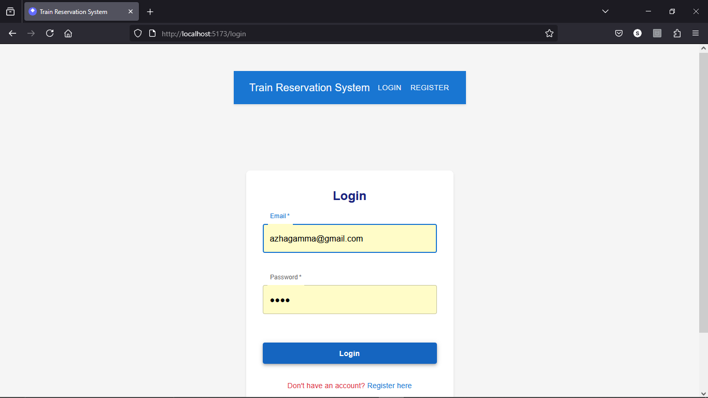
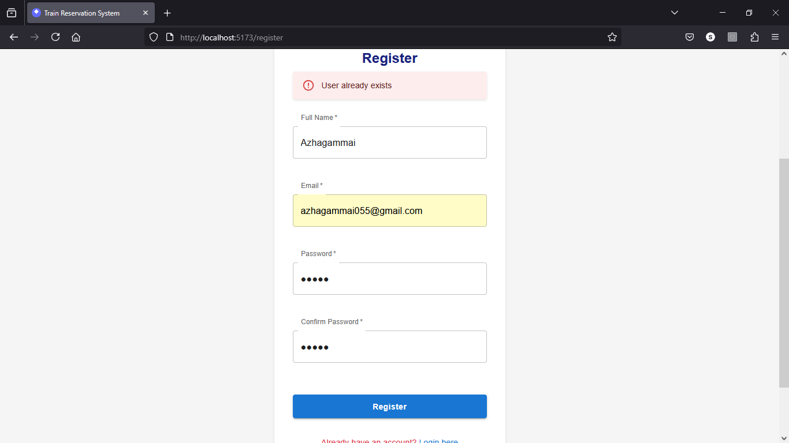
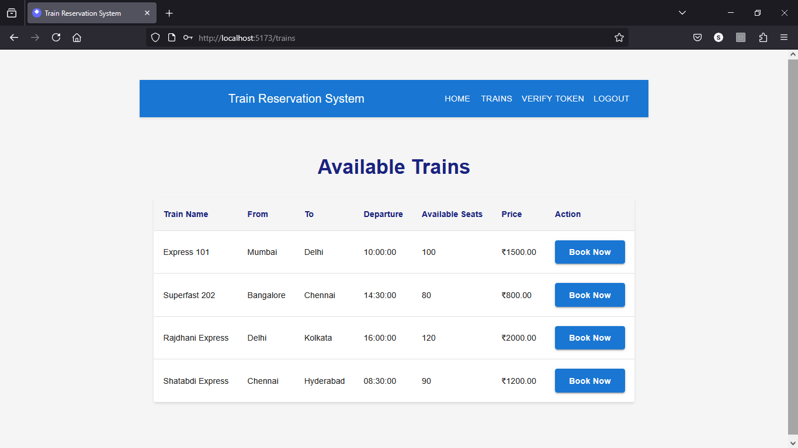
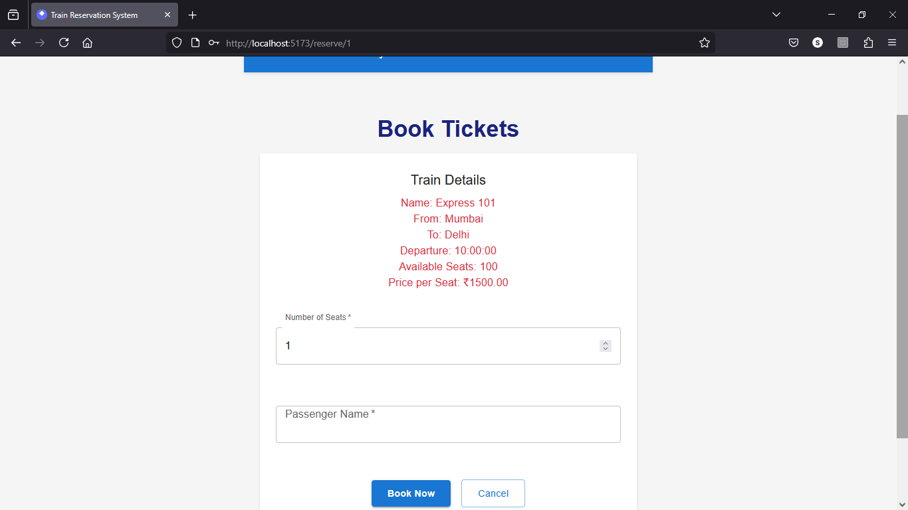
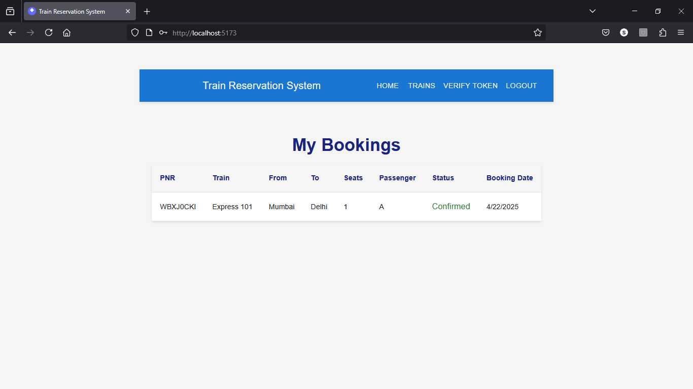
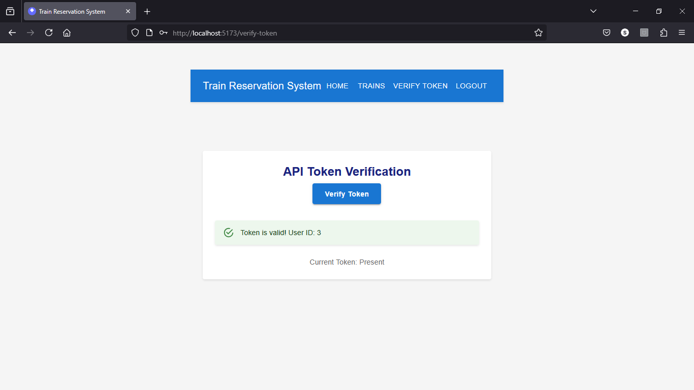
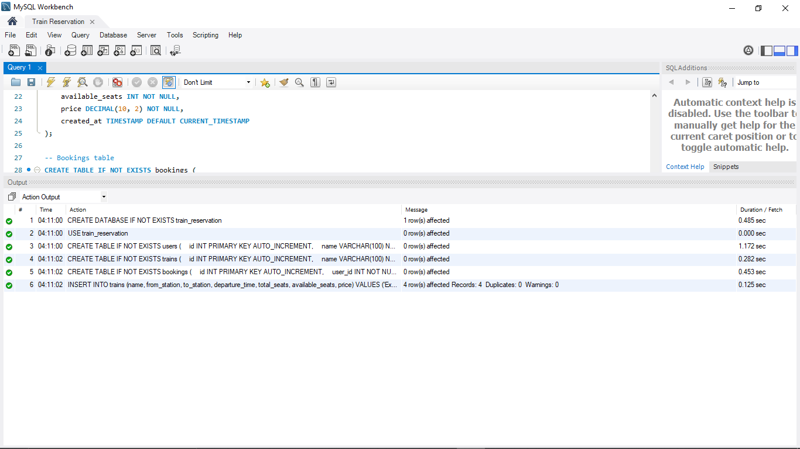

# Train Reservation System

A full-stack train reservation system built with React and Node.js.

 ## 📸 Screenshots

### 🔐 Login Page


### 📝 Register Page


### 🚄 Available Trains


### 🎟️ Book Tickets


### 📜 My Bookings


### ✅ Token Verification


### 🗃️ Database Design



## Project Structure

```
22BAD094/
├── train-reservation/
│   ├── frontend/         # React frontend
│   └── backend/          # Node.js backend
└── .gitignore
```

## Setup Instructions

### Backend Setup

1. Navigate to the backend directory:
   ```bash
   cd train-reservation/backend
   ```

2. Install dependencies:
   ```bash
   npm install
   ```

3. Start the server:
   ```bash
   npm start
   ```

The backend server will run on http://localhost:5000

### Frontend Setup

1. Navigate to the frontend directory:
   ```bash
   cd train-reservation/frontend
   ```

2. Install dependencies:
   ```bash
   npm install
   ```

3. Start the development server:
   ```bash
   npm run dev
   ```

The frontend application will run on http://localhost:5173

## Features

- View available trains
- Check seat availability
- Make train reservations
- Mobile-responsive design

## Technologies Used

- Frontend:
  - React
  - React Router
  - Material-UI
  - Axios

- Backend:
  - Node.js
  - Express
  - JSON Web Tokens
  - CORS
 
 
